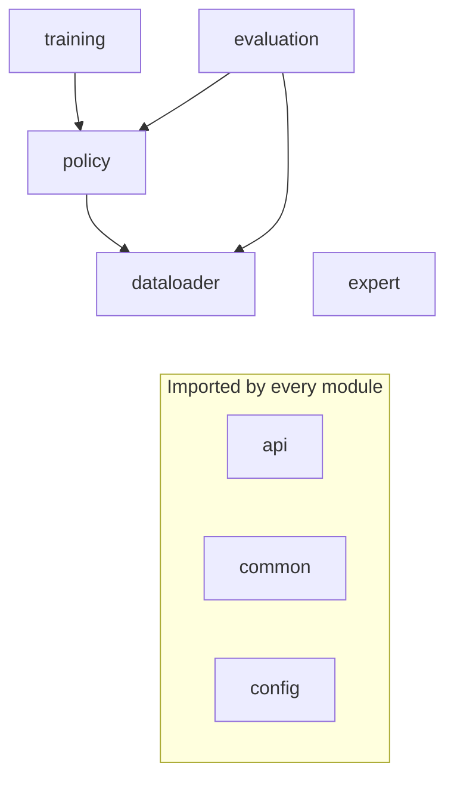

# Project structure

Dependency graph

Module's functionality

| Module       | Role                                                                                                                                                                         |
| :----------- | :--------------------------------------------------------------------------------------------------------------------------------------------------------------------------- |
| `api`        | The project's contracts: the LEAD log layout (`py123d_log_api`), the `AbstractPolicy` every policy implements, and the `AbstractDrivingAgent` CARLA adapter around a policy. |
| `common`     | Building blocks shared across modules: geometry, localization, planning, PID control, the CARLA `BaseAgent`, the sensor rig and CARLA→py123d conversion.                     |
| `config`     | The `LeadConfig` tree and profiles: every knob for expert, policies, training, and evaluation.                                                                               |
| `dataloader` | Generic py123d loader: scene enumeration, filtering, and raw modality reads (see [data access](data_access.md)).                                                             |
| `expert`     | Privileged expert agent that drives CARLA routes and writes the py123d logs (see [data collection](data_generation.md)).                                                     |
| `policy`     | One package per policy implementation (TransFuser), each with its own model-specific dataloader.                                                                             |
| `evaluation` | Closed-loop harness: runs a policy as a CARLA agent, tracks scene state, records video and infractions (see [evaluation](eval.md)).                                          |
| `training`   | Model-agnostic training entry point; depends on policies only through `AbstractPolicy` (see [training](training.md)).                                                        |
| `routes`     | CARLA route XMLs — `data_routes` for collection, `benchmark_routes`, `debug_routes`. No code; files are passed by path to the runners.                                       |
